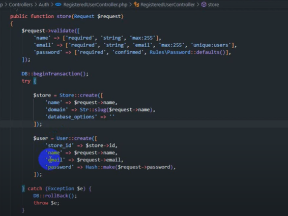
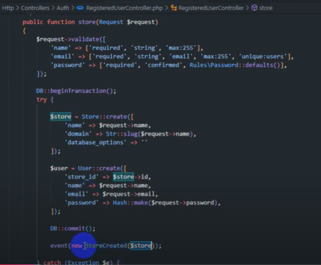

# My Template

## How to use:

  - clone the repo.
  - composer install
  - php artisan generate:key
  - php artisan optimize:clear
  - php artisan passport:install
  - php artisan storage:link
  - php artisan migrate:refresh --seed

    OR
  - php artisan migrate:refresh
  - php artisan db:seed

## Names Modules in this project:
    * for users pages
        - Geocode :
            for  Countries,Cities,States,Areas,Addresses

        - Profile
            for  profiles in website

        - Banner
            for  banners in website

        - Board
            for  boards in website

        - Chat
            for  chats in website

        - Contact
            for  contact in website

        - Favorite
            for  favorites in website

        - Notification
            for  notifications in website

        - RequestWithdrawing
            for  RequestWithdrawings in website

        - Review
            for  Reviews in website

        - Order
            for  orders in website

        - Payment
            for  payments in website

        - Wallet
            for  Wallets in website

        - Movement
            for  movements in website
        
    * for admin pages (management all prev. moduleس)
        - Auth :
            for management Users,Roles,Permissions


## Scopes (Local And Global) Traits And helpers :
    - Scopes:
        * global
            ActiveScope : for make active when status =1 in whole project
            LanguageScope 
        And to apply it on the whole project will put this method in App\Models\BaseModel.php file and will all model extends from this class BaseModel to excute these scopes and any thing in this file in all model
        ------------------------------------------------------------
        protected static function boot()
        {
            parent::boot();
            static::addGlobalScope(new ActiveScope);
            static::addGlobalScope(new LanguageScope);
        }
        ------------------------------------------------------------
## General file structure :
    - app
        - Helper
            constants.php
            response.php
        - Http
            - Controllers
                -API
                    -Auth
                        - Admin
                            LoginController
                        - User
                            LoginController
                            RegisterController
                        - RecoveryPasswordController
                        - FileController
                        - HomeController
            - Middleware
                - Localization
            - Requests
                - Auth
                    - User
                        - RegisterRequest.php
                    - CheckCodeRequest.php
                    - ForgotPasswordRequest.php
                    - LoginRequest.php
                    - ResetPasswordRequest.php
                - UploadFilesRequest.php
        - Jobs
            SendMessageJob.php
        - Listeners
            ChatMessageListener.php
        - Mail
            General.php
            Welcome.php
        - Models
            - Traits
                - Role
                    GeneralRoleTrait.php
                    RoleAttributes.php
                    RoleMethods.php
                    RoleRelations.php
                    RoleScopes.php            
                - User
                    GeneralUserTrait.php
                    UserAttributes.php
                    UserMethods.php
                    UserRelations.php
                    UserScopes.php
            BaseModel.php
            File.php
            Job.php
            PasswordReset.php
            Permission.php
            Role.php
            User.php
            PersonalAccessToken.php
            RegisterCodeNum.php

        - Providers
            TelescopeServiceProvider.php
        - Repositories
            - Auth
                - Login
                    - Admin
                        LoginRepository.php
                        LoginRepositoryInterface.php
                    - User
                        LoginRepository.php
                        LoginRepositoryInterface.php
                - Recovery
                    - Password
                        PasswordRepository.php
                        PasswordRepositoryInterface.php
                -Register
                    - User
                        RegisterRepository.php
                        RegisterRepositoryInterface.php
            EloquentRepository.php
            EloquentRepositoryInterface.php
        - Routing
            ResourceRegister.php
        - Scopes
            ActiveScope.php
            LanguageScope.php

        -Services
            GeneratePdfService.php
            PaymentMethodService.php
            ProccessCodesService.php
            SendingMessagesService.php
            SendingNotificationsService.php
            VonageCheckValidateNumber.php

        - GeneralClasses:
            MediaTrait.php
        for functions that use general in website
    - Modules
        - Banner
            - Config
            - Console
            - Database
            - Entities
                - Traits
                    - User
                        BannerMethods.php
                    BannerRelations.php
                    BannerScopes.php
                    GeneralBannerTrait.php
                    Banner.php
            - Http
                - Controllers
                    - API
                        - User
                            BannerResourceController.php
                    - Middleware
                    - Requests
                    - Providers
                    - Repositories
                        - API
                            - User
                                - Resources
                                    BannerRepository.php
                                    BannerRepositoryInterface.php
                        - WEB
                    - Resources
                        - User
                            BannerResource.php
                    - Routes
                        api.php
                        web.php
                    - Tests

    * And other modules have same structure approx.


# Technologies And Packages that were used:
## Authentication:
### Login And Register
    
    by using packages  sanctum and passport:

    these packages installed default in laravel 9 and 10 , but i will select passport , because  its contain many features more than sanctum 

    which is support OAuth , Apis token , but will need to keep the token in storage counter to sanctum (keep this token in auth in laravel default)

    but will use passport Because there are advantages in it more comprehensive than sanctum

    https://stoffel.io/blog/laravel-passport-vs-sanctum

    send into email or phone no.:
    by using  MAIL_HOST : smtp.gmail.com to send into email
    And Vonage to send into phone no.
    https://dashboard.nexmo.com/getting-started/sms

### Laratust : for roles, psermissions:

    - composer require "santigarcor/laratrust:3.2.*"
    - in config/app.php in providers array:
        Laratrust\LaratrustServiceProvider::class,
    - in config/app.php in aliases  array:
        'Laratrust'   => Laratrust\LaratrustFacade::class,
    - php artisan vendor:publish --tag="laratrust"
    - app/Http/Kernel.php in array : routeMiddleware 
    'role' => \Laratrust\Middleware\LaratrustRole::class,
    'permission' => \Laratrust\Middleware\LaratrustPermission::class,
    'ability' => \Laratrust\Middleware\LaratrustAbility::class,
    - in file laratrust_seeder.php will define permissions and roles
```
    'roles_structure' => [
        'superadmin' => [
         
        ],

        'permissions_map' => [

        ]
```

## HMVC:
    - composer require nwidart/laravel-modules

    - php artisan vendor:publish --provider="Nwidart\Modules\LaravelModulesServiceProvider"

    or To publish only the config: 
 
    - php artisan vendor:publish --provider="Nwidart\Modules\LaravelModulesServiceProvider" --tag="config"

    - in composer.json in autoloading using psr-4 :
      "Modules\\": "Modules/"

    - composer dump-autoload

    - php artisan module:make Auth 

### using package for optimizing:
        https://laravel.com/docs/11.x/telescope
        - composer require laravel/telescope --dev
```
"laravel/telescope": "^5.2",
    && 
"extra": {
    "laravel": {
        "dont-discover": [
            "laravel/telescope"
        ]
    }
},
```
        * in db
        - php artisan telescope:install
        - php artisan migrate

        * In register() in app service provider
```
            if ($this->app->environment('local')) {
                  $this->app->register(\Laravel\Telescope\TelescopeServiceProvider::class);
                  $this->app->register(TelescopeServiceProvider::class);
              }
```
        * Examples in methods
            * login
                public function checkLogin($request){
                    $user = User::where('email', 'like',  $request->get('email'))
                                ->orWhere(function($query) use ($request) {
                                    $query->where('phone_no', $request->get('phone_no'))
                                        ->where('country_id', $request->get('country_id'));
                                })
                                ->first();
                    $roles= $user->roles->pluck('name')->toArray();
                    if(!in_array('user',$roles)) return trans('messages.Invalid credentials');
        
                }
```
            --- to optimize this method:
                    public function checkLogin($request)
                    {
                        $user = User::with('roles:name')
                                    ->where(function ($query) use ($request) {
                                        $query->where('email', $request->get('email'))
                                              ->orWhere(function ($query) use ($request) {
                                                  $query->where('phone_no', $request->get('phone_no'))
                                                        ->where('country_id', $request->get('country_id'));
                                              });
                            })
                            ->first();
                        if(!$user || !$user->roles->contains('name','user')) return trans('messages.Invalid credentials');

                    }
```
    -- to showing excution this package :
        http://127.0.0.1:8000/telescope/requests

### caching
***What is Caching in Laravel?***
        
    Caching in Laravel allows you to store data temporarily to reduce the number of queries to a database or an external service. This improves the application's speed and performance by retrieving frequently accessed data from memory rather than hitting the database repeatedly.

Laravel provides several cache drivers out of the box, such as file, database, redis, memcached, and more. By default, Laravel uses the file cache driver.
```
    ** using default : file
        - in .env file
            CACHE_DRIVER=file
```
```    
    ** using redis
        - composer require predis/predis
        - in file .env
            CACHE_DRIVER=redis
            REDIS_HOST=127.0.0.1
            REDIS_PORT=6379
```
```
    *  Basic Cache Operations
        - Storing data in cache:
            Cache::put('key', 'value', $seconds); // Store a value for a specific duration
        - Retrieving data from cache:
            $value = Cache::get('key');
        - Storing data indefinitely:
            Cache::forever('key', 'value'); // The value stays until manually deleted
        - Deleting from cache:
            Cache::forget('key');
        - Cache::remember($key, $sec, $clouser fun);// checks if the cache key  exists. If it       doesn't, it executes the closure, stores the result in the cache, and returns it. The cached data will be available for  seconds (1 hour).
```
***Cache Example***
```
        - Storing Data in Cache
            Cache::put('user_data', $user, 600); // Store user data for 10 minutes (600 seconds)
        - Retrieving Data from Cache
            $user = Cache::get('user_data', function() {
                        // Fetch data from database if it's not in the cache
                        return User::find(1);
                    });
        - Deleting Cache
            Cache::forget('user_data');
        - in controller:
            public function index()
            {
                $users = Cache::remember('users', 3600, function () {
                    return User::all();
                });

                return view('users.index', compact('users'));
            }
```
 ***another ex.***
 ```
            - in controller:
                Cache::put('latest_posts', Post::latest()->take(10)->get(), 600); // Cache latest 10 posts for 10 minutes
            - Retrieving Cached Data:
                $latestPosts = Cache::get('latest_posts');
            - Testing Cache in Code:
                - Store the data in cache:
                    Cache::put('cached_data', 'This is a test', 600); // Store data for 10 minutes
                - Retrieve the data:
                    $data = Cache::get('cached_data');
                    dd($data); // Check the result in your browser
```
***Tagging Cache***

        to group related cache data. Such as : key  cache has many tags and same tags possible used via other keys cache .
        - Cache::tags(['people', 'artists'])->put('user', $user, 600); // Cache a user in the "people" and "artists" tag group

        - Retrieving cached data using tags:
            $user = Cache::tags(['people', 'artists'])->get('user');
    ** Clearing Cache
        php artisan cache:clear

    By following these steps, you can efficiently cache data in Laravel, improving performance by reducing the number of database queries or external service calls.

### Jobs & Queue & Corn Jobs
    * job :
        to handle time-consuming operations without blocking the user interface (excuting in background) , which is this code will put in handle method in this job .
        Use in -> sending emails, processing images, or interacting with external APIs.

        -- create job -> php artisan make:job SendingEmailJob

        And must class job implements ShouldQueue

        To calling this job via : dispatch OR after a specific time -> schedule job in laravel app(Or corn job in server) 
        Like : 
           Normal Job -> dispatch(new SendingEmailJob($email,$type,$data));
           or if want determine type a queue -> dispatch(new SendingEmailJob($email,$type,$data))->onQueue('import');
           **to excute it** php artisan queue:work

           Schedule Job - $schedule->job(new AssignSessionItemsJob(auth()->guard('api')->user()))->everyMinute();
           in method schedule in App\Console\kernel.php
           **to excute it** php artisan schedule:run Or :work -> to watch any changes

        Command :
        *** Diff. between schedule job & Corn  ***
            Both using same file schedule job &  excute after a specific time but the diff. in excuting which is :
            ** schedule job ** use in laravel app , So command -> 
            php artisan schedule:run
            ** Corn job ** use in server , So command -> 
            * * * * * php /path-to-your-project/artisan schedule:run >> /dev/null 2>&1

        
    * Queue :
        when using job will use queue to make management between jobs in background to improve the performance of application .
        Must run queue to run all jobs that inside this queue
        Command :
        -- php artisan queue:table
        -- php artisan migrate && will write type database in file .env : QUEUE_CONNECTION=database
        -- to run queue that inside it this job -> php artisan queue:work
            OR php artisan queue:listen -> to watch any changes
        php artisan queue:work --emails -> this run queue just in this type so not excute all jobs , only jobs that determine type queue - emails Like : dispatch(new SendingEmailJob($email,$type,$data))->onQueue('emails');
        this will create in table jobs a row for type this queue : emails not default

    #### Summery (Jobs - Queue - Scheual) ###
        Jobs: Represent individual tasks.
        Queues: Manage the asynchronous execution of jobs.
        Cron Jobs: Schedule tasks to run at specific times or intervals, which can include dispatching jobs.
        Each of these components plays a crucial role in making Laravel applications more efficient and manageable, especially when dealing with background processing and task scheduling.
### Events & Listiners
    * Definition
        * Events : classes that represent actions occur in  the website
        * Listiners : classes that respond to events. When an event is fired, the associated listeners are executed to handle the event's logic.
    * Creation
        Event : php artisan make:event UserRegistered
        Listiner : php artisan make:listener SendWelcomeEmail
    * Usage
        Listiner : in method handle
                    Mail::to($event->user->email)->send(new WelcomeEmail());
        event : event(new UserRegistered($user));
#### Broadcast
    use in real time , such as : websocket 
    which is use in event class to make real time 
    Which is , when occur this event will go into website pusher or redis (servers support realtime) ->  to notify clients about changes or updates in real-time
    * Usage :
    in file event
    - class UserRegistered implements ShouldBroadcast

    - public function broadcastOn()
        {
            return new Channel('users');
        }
    - calling this event via broadcast
        event(new UserRegistered($user));
    - to excute realtime ( client side)
        Echo.channel('users')
        .listen('UserRegistered', (e) => {
            console.log('User registered:', e.user);
        });

    ### Summary(Events - Listeners - Broadcasting) ###
        Events: Represent occurrences in your application and are dispatched when they happen.
        Listeners: Respond to events and contain the logic to handle them.
        Broadcasting: Allows you to send events to client-side applications in real-time, enhancing interactivity.
    Using events, listeners, and broadcasting together allows for a clean, modular, and reactive application architecture in Laravel.
    
    https://laravel.com/docs/10.x/broadcasting#pusher-channels
    
##### WebSocket 
    WebSocket is a protocol 
    - Real-Time Communication: that enables full-duplex communication channels (2 way comm. between client & server) making realtime apps. like : chat apps or live apps
    - Efficiency: Reduces the overhead of HTTP by keeping the connection open, allowing for  faster message exchange.
    - Browser Support: Supported by modern web browsers and can be used in various programming environments.
    ** diffention with event : **
    Broadcast server support real time , which is connect between many clients shared with this server , any msg come into this server will go into all these clients
    And when occur an event that  waiting for an a client , this client recieve this event via websocket ->realtime

#### Socket.IO
    A JavaScript library that enables real-time between client & server.
    That enhances the capabilities of WebSocket with additional features like fallbacks, event handling, and broadcasting.

### Notification : channels -> broadcast(realtime) - database - mail - nexmo(sms) - slack
```
- public function via($notifiable){
        $via = ['broadcast','database','mail'];
        if($notifiable->notify_mail){
            $vai[] = 'mail';
        }
        if($notifiable->notify_nexmo){
            $vai[] = 'nexmo';
        }
        return $via;
    }
```
#### in Broadcast 
like event ->listen an event  when occur action will excute event (send notifications to users) 
** In server side
    - in .env
        BROADCAST_DRIVER=pusher
    - enabel broadcast in config\app.php:
        in arr providers -> 
        Illuminate\Broadcasting\BroadcastServiceProvider::class,
    
    - public function toBroadcat($notifiable)
        {
            $body = ;
            return new BroadcastMessage([
                'title'=> ,
                'body'=> ,
                'icon'=> ,
                'url'=>
            ]);
        }
    *** brodcast contain 3 channels : 
    public: all clients that connect with this channel-> recieving msgs
    private : only clients that have auth in this channel to recieving msgs
    presnence: same private , only give infos. about these clients
    SO now will determine type channel for broadcast:

    - Brodacast::channel('App.Models.User.{id}',function($user,$id)){
            return (int) $user->id === (int) $id;
        }
    in this step will send the msg into pusher server realtime , but if i need see this realtime in client side will next steps.
***in client side*** (echo ->make real time in client side)

    - npm i laravel-echo pusher-js -dev
    - in bootstrap.js:
        import Echo from 'laravel-echo';
        window.Pusher = require('pusher-js');
        window.Echo = new Echo({
            broadcaster : 'pusher',
            key: proccess.env.MIX_PUSHER_APP_KEY,
            cluster: proccess.env.MIX_PUSHER_APP_CLUSTER,
            forceTLS: true
        });
    - listen for event notification:
     in app.js:
        require('./boostrap');
        require('alpinejs')
        window.Echo.private(`App.Models.User.${userId}`)
            .notification(function(data)){
                alert(data.body)
            }
    - in layouts/app.blade.php
        <script>
            const userId = "{{Auth::id()}}"
        </script>
        <script src="{{asset('js/app.js')}}"></script>
    
    ** when user connect with the channel will pass in 3 levels :
        occupied : wait accour an action to make an event in pusher server
        disconnected: disconnect this client with channel
        subscried : now will be connection 
        connected : connected with channel
    - render notifications in front after test via alert will render here:
        <div>
        <ul>
            @foreaach($notifications as $notification)
                <li>
                    <a href=""></a>
                    <span class="notification-icon"></span>
                    <span class="notification-text">
                        @if($notification->unread())
                        <strong>*</strong>
                        @endif
                        {{$notification->data['body']}}
                    </span>
                </li>
            @endforeach
        </ul>
        </div>
    - update on this , instead alert will write this:
        window.Echo.private(`App.Models.User.${userId}`)
            .notification(function(data)){
                $('#notificationList').preappend(`<li class="notifications-not-read">
                <a href="${data.url}?notify_id=${data.id}">
                    <span class="notification-icon"></span>
                    <span class="notification-text">
                        <strong>*</strong>
                        ${data.body}
                    </span>
                </a>    
                </li>`);
                let count = Number($('#newNotifications').text())
                count++;
                if(count>99){
                    count = '99+'
                }
                $('#newNotifications').text(count)
            }
** another server deal with broadcast not only pusher , local server
https://beyondco.de/docs/laravel-websockets/getting-started/introduction

#### Database 

    - create table notification : php artisan notifications:table & php artisan migrate
    - create notification: php artisan make:notification 
    -  public function toDatabase($notifiable)
        {
            $body = ;
            return new BroadcastMessage([
                'title'=> ,
                'body'=> ,
                'icon'=> ,
                'url'=>
            ]);
        }
    - calling noti. :  $ ->user->notify(new ); or Notification::send( , new );

    - get notifications :
    $user->unreadNotifications()->count();

    - to make as read when click on an noti.:

    * make middleware : MarkNotificationAsRead & add it in middleware arr in kernel & in routes web or api & in routeMiddleware arr -> to put this moiddlware in route click this noti.

    * file notification middleware
        class MarkNotificationAsRead
        {
            public function handle(Request $request , Closure $next){
                $user = $request->user();
                $notify_id = $request->query('notify_id');
                if($notify_id){
                    $notification = $user->unreadNotifications()->find($notify_id);
                    if($notification){
                        $notification->markAsRead();
                    }
                }
            }
        }

#### Mail
    - setup in .env

    -  public function toMail($notifiable)
        {
            $body = ;
            $message =  new MailMessaage;
            $message->subject('')
                    ->from('','')
                    ->greeting('')
                    ->line($body)
                    ->action('',route(''))
                    ->line('')
                    ->view('mails.',[

                    ]);
            return $message;
        }
    - php artisan vendor:publish --tag=laravel-mail
    - php artisan vendor:publish --tag=laravel-notifications

## Multiple payment gateways
can enhance flexibility and provide users with various payment options
    via repo. , interface , which is deffinition repo. -> class share in props. & names methods but diff. in implementation 
    interface(to force all classes has same structure but only diff in implemention)-> to switch(according payment gateway) between these repos
Which is any gw has a class repo implement from interface , so every gw contains on 2 meth as interface -> create , verify
And call gw via class it

Controller gw in Admin -> control activation appearing  gws for user & enter options this gw like -> APPLICATION_key, APPLICATION_SECRET

***Links***
https://github.com/paypal/Checkout-PHP-SDK

***Usage***
    - create class name gw to get namespace this class file to move into it -> that contains on create , verify meths.
```
    class PaymentGatewayFactory{
            /** 
    * create class name for gw
    * @param string $gateway
    * @return \Modules\Payment\Services\PaymentGateways\PaymentGateway
    */
    public static function create($name)
    {
        
        $class = 'Modules\Payment\Services\PaymentGateways\\' . Str::studly($name).'\\'. Str::studly($name);
        try{
            return new $class();
        }catch(\Exception $e){
            throw new \Exception("Payment gateway {{$name}} not found ");
        }
        return new $class();
    }
    }

```
    - which is meth. create will calling it , when click checkout to show multi payment gateways to select from it , to store payment_method_id & session_id ... in table payments & session this user , will take these data into sec. step -> verify(callback)->when click on pay now after enter all data payment card this user 

    ** methods in this interface must be in all classes implement this interface such as : Paypal , Thawani , strip
    - create payment(preparing data to use it in verify) :page payment-> make proccess for payment and return redirect (callback & transaction id) to use it in verify (caputer) after pay
    - verify payment : to suring from transaction id is correct or not 

```
    public function create($order, $user) // response view or route
   {
        $data = $this->paypalService->setDataPayment($order);
        try{
            $response = $this->client->execute($data);
            foreach($response->result->links as $link){
                if($link->rel == 'approve'){
                //    $payment = $this->paymentService->createPayment($order , $user , $response);
                //store transaction id , payment id in session
                  //  Session::put('transaction_id',$response['session_id']);
                  //  Session::put('payment_id',$payment->id);
                //    return $link->href;
                    return redirect()->away($link->href);// away -> redirect for external link
                }
            }
            if($response->rel == 'approve'){
            }
        } catch (Exception $ex) {
            echo $ex->statusCode;
            print_r($ex->getMessage);

        }
   }
   public function verify($id) : Payment//when click on pay now
   {
        $resultPayment = $this->paymentService->getPayment();
        $request = new OrdersCaptureRequest($id);
        $request->prefer('return=representation');
        try{
            $response = $this->client->execute($request);
            if($response->result->status == 'COMPLETED'){
                $payment = $this->paymentService->updatePayment($id, $paymentMethodId,$status = 1);
            }elseif($response->result->status == 'CANCELED'){
                $payment = $this->paymentService->updatePayment($id, $paymentMethodId,$status = -1);
            }
            Session::forget(['payment_id','session_id']);
            return $payment;
        }catch(HttpException $ex){
            echo $ex->statusCode;
            print_r($ex->getMessage());
        }
   }
   //method formoptions to showing in dashboard 2 inputs -> client_id , secret_id after enter it will add these into gw in db 
   public function formOptions() : array
   {
        return [
            'client_id' => [
                'type' => 'text',
                'label' => 'Client ID',
                'placeholder' => 'Client ID',
                'required' => 'true',
                'validation' => 'required|string|max:225',
            ],
            'client_secret' => [
                'type' => 'text',
                'label' => 'Client Secret',
                'placeholder' => 'Client Secret',
                'required' => 'true',
                'validation' => 'required|string|max:225',
            ]
        ];
   }

```
    meth services gw in file like : PaypalService
```
    public function client(){// this meth for only paypal
        if(!$this->client){// in the starting , client not created
            if (empty($this->paymentMethod->options['client_id']) || empty($this->paymentMethod->options['client_secret'])) {
                \Log::error('PayPal Client ID or Secret is missing.');
                throw new \Exception('Invalid PayPal credentials.');
            }
            $this->client = new PaypalHttpClient(
                    new SandboxEnvironment(
                        $this->paymentMethod->options['client_id'] ?? null ,// options -> col in payment_methods in db , that it enter in construct Paypal class
                        $this->paymentMethod->options['client_secert'] ?? null,
                        // env('PAYPAL_CLIENT_ID'),
                        // env('PAYPAL_CLIENT_SECRET'),
                    )
                );   
        }
        return $this->client;
        
    }
    public function setDataPayment($order){
        $request = new OrdersCreateRequest();
        $request->prefer('return=representation');
        $request->body = [
                        "intent"=>"CAPTURE",
                        'purchase_units' => [[
                            "reference_id"=>"test_ref_id1",
                            "amount"=>[
                                "value"=>10,
                                "currency_code"=>"USD"
                            ]
                        ]],
                        "application_context" => [
                            "cancel_url" => route('payment.cancel','paypal'),
                            "return_url" => route('payment.return','paypal'),
                        ]
            ];
        return $request;

    }
```
    services method in paymentservice for every gw
```
     //get payment , payment method , transaction
    public function getPayment(){
        $paymentMethodSlug = Session::get('payment_method_id');
        $paymentMethod = PaymentMethod::where('slug',$paymentMethodSlug)->first();
        if(!$paymentMethod) return trans('messages.this slug payment method not found , pls select again');
        $transactionId = Session::get('transaction_id');
        $payment = Payment::where(['transaction_id'=>$transactionId])->first();
        if(!$payment) return 404;
        return [
            'payment_method'=>$paymentMethod,
            'payment'=>$payment,
            'transaction_id'=>$transactionId
        ];
    }
    public function createPayment($order , $user , $response){
        $payment = Payment::create([
            // 'payment_method_id'=>$this->paymentMethod->id,
            'paymentable_id'=>$order->id,
            'paymentable_type'=>get_class($order),
            'payer_id'=>$user->id ,
            'payer_type'=>get_class($user),
            'amount'=>$order->total,
            'currency_code'=>$order->currency_code,
            'type'=>'payment',
            'status'=>0,
            'transaction_id'=>$response->transaction->id,
            'payment_response'=>$response->result
        ]);
        return $payment;
    }
    public function updatePayment($id, $paymentMethodId, $status){
        $payment = Payment::where('transaction_id',$id)
                    ->where('payment_method_id', $paymentMethodId)
                    ->first();
        $payment['status'] = $status;
        $payment->save();
        return $payment;
    }
```


***Routes***

--checkout--

 get page to select one of gw & post to go into redirect nto paypal page via create method paypal file will redirect into paypal page (callback) after enter all data in this page and press on pay now will calling meth verify in paypal file .
```
    Route::get('checkout', [CheckoutController::class,'index'])->name('checkout.index');
    Route::post('checkout', [CheckoutController::class,'store'])->name('checkout.store');
```
--return & cancel -- when callback
```
    Route::any('payments/{slug}/return',[CheckoutController::class, 'callback'])->name('payment.return');
    Route::any('payments/{slug}/cancel',[CheckoutController::class, 'cancel'])->name('payment.cancel');
```

***response create (page payment)***
```
        Status Code: 201
        Id: 8GB67279RC051624C
        Intent: CAPTURE
        Gross_amount:
        Currency_code: USD
        Value: 100.00
        Purchase_units:
        1:
            Amount:
                Currency_code: USD
                Value: 100.00
        Create_time: 2018-08-06T23:34:31Z
        Links:
        1:
            Href: https://api.sandbox.paypal.com/v2/checkout/orders/8GB67279RC051624C
            Rel: self
            Method: GET
        2:
            Href: https://www.sandbox.paypal.com/checkoutnow?token=8GB67279RC051624C
            Rel: approve
            Method: GET
        3:
            Href: https://api.sandbox.paypal.com/v2/checkout/orders/8GB67279RC051624C/capture
            Rel: capture
            Method: POST
        Status: CREATED
```
    *** response from verify(capturing) ***
```
        Status Code: 201
        Id: 8GB67279RC051624C
        Create_time: 2018-08-06T23:39:11Z
        Update_time: 2018-08-06T23:39:11Z
        Payer:
            Name:
                Given_name: test
                Surname: buyer
            Email_address: test-buyer@paypal.com
            Payer_id: KWADC7LXRRWCE
            Phone:
                Phone_number:
                    National_number: 408-411-2134
            Address:
                Country_code: US
        Links:
            1:
                Href: https://api.sandbox.paypal.com/v2/checkout/orders/3L848818A2897925Y
                Rel: self
                Method: GET
        Status: COMPLETED
```
***Explain Services Methods***

- create meth. : when click on checkout to showing page payment gateway to select from it to showing after it the page payment 

    contain on :
    setDataPayment -> every payment gateway diffenerent about the other , according on doc. in every payment gateway
    like this :
    protected function setDataPayment($order,$user){
            $data['amount']= $order->price;
            $data['currency']= systemCurrency();
            $data['customer']['first_name']= $user ? $user->full_name : null;
            $email = $user ? $user->email : null;
            if(!$email) $email = $user ? $user->full_name.' '.'#'.$order->id.'@template.net' : null;
            $data['customer']['email']= $email;
            $data['customer']['phone']['number']= $user ? $user->phone_no : null;
            $data['source']['id']= "src_all";
            return $data;
        }
After this setDataPayment will calling execute meth for this data to take response 
like this :
```
$response = $this->client->execute($data);
```
And from this response will take url for callback url
And will create payment in db(payment_id from input data,session_id from response) & in session
- verify meth. : when click on pay now
 will getdata payment to enter into execute meth.
 like this: 
```
    $response = $this->client->execute($request);
```
And meth. getDataPayment
//get payment , payment method , transaction
```
    protected function getPayment(){
        $paymentMethodSlug = Session::get('payment_method_id');
        $paymentMethod = PaymentMethod::where('slug',$paymentMethodSlug)->first();
        if(!$paymentMethod) return trans('messages.this slug payment method not found , pls select again');
        $transactionId = Session::get('transaction_id');
        $payment = Payment::where(['transaction_id'=>$transactionId])->first();
        if(!$payment) return 404;
        return [
            'payment_method'=>$paymentMethod,
            'payment'=>$payment,
            'transaction_id'=>$transactionId
        ];
    }

from the response meth. excute will take status from this result as this:

if($response->result->status == 'COMPLETED'){
    $payment = $this->updatePayment($resultPayment,$response,1);
}elseif($response->result->status == 'CANCELED'){
    $payment = $this->updatePayment($resultPayment,$response,-1);
}
Session::forget(['payment_id','session_id']);

Any project need into multi payment gateways or one payment gateway , 
Anything general we can make specific, but anything specific we cannot generalize. From this perspective, we will use this senario 
which is when use  payment gateway , will be payment method id = 1 always & will focus on 1 file payment method like Stripe just 
```
***Example redirect***
```
https://www.sandbox.paypal.com/signin?intent=checkout&ctxId=xo_ctx_2EU32914HB096704B&returnUri=%2Fwebapps%2Fhermes&state=%3Fflow%3D1-P%26ulReturn%3Dtrue%26token%3D2EU32914HB096704B%26ssrt%3D1730746330056%26rcache%3D1%26useraction%3DCONTINUE%26cookieBannerVariant%3D1&locale.x=en_EG&country.x=EG&flowId=2EU32914HB096704B&sso=true
```

### Scopes 
a way to apply query logic for eloq. models 

### Global Scope 
a query constraint applied Automatically  to all queries of a model, ensuring certain conditions are always met. Useful for persistent constraints.
 , but when i need except it will use this keyword withoutGlobalScope as this :
```
$role->users()->withoutGlobalScope(ActiveScope::class)->withoutGlobalScope(LanguageScope::class)->paginate(total());
```

***Implementation***
- create App\Scopes\ActiveScope
```
class ActiveScope implements Scope
{
    public function apply(Builder $builder, Model $model)
    {
        $builder->where('active', 1);
    }
}
```
- Apply the Global Scope to a Model:
in model User ex.:
```
protected static function booted()
    {
        static::addGlobalScope(new ActiveScope);
        //static ::addGlobalScope('active', function(Builder $builder){
        //    $builder->where('status','=','open');
        //});
        static ::addGlobalScope('myProducts', function(Builder $builder){
            $builder->where('user_id','=',Auth::user()->id);
        }); //when any get query automaticly will get that for this user like in project store -> get all products only that i have it

    }
```
OR will will apply in model general and will all models will extends from this model , like App\Models\BaseModel
```
class BaseModel extends Model
{
    protected static function boot()
    {
        parent::boot();
        static::addGlobalScope(new ActiveScope);
        static::addGlobalScope(new LanguageScope);
    }
}
```
meth. boot : meth in laravel use to make initialization operations for models like ServiceProvider : boot for whole app
So any conditions inside it will applying automaticly

- $builder : instance from query builder , which is alwaysany model when build any query , use inside it : query builder


***Usage***
```
$users = User::all(); // Automatically filtered to only active users
```
in filer:
```
public function scopeFilter(Builder $builder, $filters){
    $filters = array_merge([
        'type'=>null,
        'status'=>null,
        'budget_min'=>null,
        'budget_max'=>null,
    ],$filters);
    if($filters['type']){
        $builder->where('type','=',$filters['type']);
    }
    if($filters['status']){
        $builder->where('status','=',$filters['status']);
    }
    if($filters['budget_min']){
        $builder->where('budget_min','=',$filters['budget_min']);
    }
    if($filters['budget_max']){
        $builder->where('budget_max','=',$filters['budget_max']);
    }
}
```
use filter scope:
```
$user->posts()->filter(['status'=>1,'budget_min'=>2000])
```
#### SoftDelete
Are implemented using a global scope in Laravel , because applied automaticly on model. 
```
$users = User::all(); // This will NOT include soft deleted users (Taking into consideration condition in softdelete scope)
```

and if i need without this global scope will use : (Not Taking into consideration condition in softdelete scope) -> withTrash instead withoutGlobalScope

```
$allUsers = User::withTrashed()->get(); // This includes soft deleted users
```


### Local Scope
a query constraint  applying Manually applied when needed, allowing for reusable query logic without affecting other queries.
means that : to apply it in a query , must calling it , when not calling it dont apply on this query that in this model that contain this scope
***Implementation***
```
public function scopeType($query)
{
    return $query->where('type', 1);
}
public function scopeMyProducts($query)
{
    return $query->where('user_id', Auth::user()->id);
}
public function scopeHigh(Builder $builder){
    $builder->orderBy('budget','DESC');
}
```
***Usage***
```
 Post::type()->get(); //get only post have type = 1
 ::myProducts()->get();//get products only that i have it
 $user->projects()->high();//get projects that have high buget (order by desc)
```
Both Local & global scopes will write method scope in the model , but difference in implementation method & usage 
in usage : global-> when get data from model automaticly get data with taking consideration condition that inside global scope method , and if i need without it , will write withoutGlobalScope
local -> when get data from model , not automaticaly with condition in local scope , while must determining

## Accessors & Mutators
### Accessors 
A way to displaying values from db in a specific 
syntax : must start with keyword->get & end with keyword -> Attibute & between it keyword attribute that stored in db like -> status or -> profile_photo , & must this attr. start char -> capitil letter
or possible write any word between keywords(get,Attribute) , but must use same keyword attr. after keyword $this that inside fun.

```
Ex.:
public function getProfilePhotoAttribute(){
    if($this->profile->profile_photo) return asset('storage/' . $this->profile->profile_photo);
    else return asset('images/default-photo.jpg');
}
```
***Usage***
```
$user->profile->profile_photo
```
-----------------------------------
OR 
```
public function getNameAttribute($value)
{
    return ucfirst($value);
}
```
***Usage***
```
    $user->name 
Output: Engalaa instead engalaa
    To get all names in capital letter
``` 
-------------------------------------
OR
```
public function getActiveAttribute()
{
    return $this->attributes['active'] ?? null;
}
public function getOriginalActiveAttribute()
{
    return isset($this->attributes['active']) 
        ? trans($this->attributes['active'] ? 'attributes.Active' : 'attributes.Not Active')
        : null;
}
```
***Usage***

    $user->active : 1 or 0 , $user->originalActive : Active or NotActive
Which is :
getActiveAttribute this to keep original value when i use it 
getOriginalActiveAttribute to appear value that i need it to appear like : Active or NotActive


### Mutators
A way to entering values into db in a specific 
```
Ex. :
public function setPasswordAttribute($value)
{
    $this->attributes['password'] = Hash::make($value);
}
```
## Service Providers & Service Containers & Facade 

```
class AppServiceProvider extends ServiceProvider{
    public function register(){
        $this->app->bind('currency', function($app){
            return config('app.currency');
        })
    }
}
```

### Facade
static classes , when using it , will calling object in service container connect with this facade
Like :
** original Facade:
```
class App extends Facade{
    //method in class Facade
    protected static function getFacadeAccessor(){
        return 'app';
    }
}
```
```
class Currency extends Facade{
    protected static function getFacadeAccessor(){
        return 'currency';// this is name var. or fun. in service container , will return inside this var. currency
    }

}
```
So , ways to storing data constant:
- Service Container -> calling it via :
```
App::make('currency');
Or
app('currency')
```
- Facade -> calling it via:
Currency
- Helper

###  Database relationships, especially with foreign keys,
#### restrict, set null, cascade, and no action
#### Restrict
- if there are forign keys (subs)  , Prevents deletion Parent of a record
```
Schema::table('orders', function (Blueprint $table) {
    $table->foreignId('user_id')->constrained()->onDelete('restrict');
});//RestrictOnDelete
```
#### Set Null
- if there are forign keys (subs) , Sets  foreign keys field(sub) to NULL when the Parent is deleted.
```
Schema::table('orders', function (Blueprint $table) {
    $table->foreignId('user_id')->nullable()->constrained()->onDelete('set null');//SetNullOnDelete()
});
```
#### Cascade
- if there are forign keys (subs) , Automatically deletes the forign keys records when the parent record is deleted.
```
Schema::table('orders', function (Blueprint $table) {
    $table->foreignId('user_id')->constrained()->onDelete('cascade');
});//CascadeOnDelete
```
#### No Action
-  No specific action; behaves like restrict in practice.
```
Schema::table('orders', function (Blueprint $table) {
    $table->foreignId('user_id')->constrained()->onDelete('no action');
});//NoActionOnDelete
```

### Commands To managing database migrations in laravel
- migrate:fresh
Drops all tables and re-runs all migrations , All data is lost

- migrate:refresh (rollback+ migrate)
Rolls back all migrations -> excute that inside method down() ,and re-runs them  in all files migration, All data is lost

- migrate:status
Shows the status of all migrations (whether they are run or not) ,  No effect on data.
- migrate:rollback
Rolls back the last batch of migrations ->excute that inside method down() in file migration, data related to thse migrations may be lost
- migrate:reset
Rolls back all migrations to the initial state (empty db approx.) ->excute that inside method down() in all files migration, all data is lost



rollback -> rollback for last batches
resfresh -> rollback all & migrate
fresh -> delete & migrate
reset ->  rollback all

Batch : arrangement excution migrations 

### Relation In Laravel


#### ORM (Object-Relational Mapping)
    way to interact with database tables using models. 
    Eloquent ORM -> simplifies relationships between database tables, making it easier to perform operations , manage and query data more effectively
    like :retrieving related data, updating, or inserting data across multiple tables.
    Eloquent ORM -> supports various types of relationships

### One-to-One Relationship
 relationship is where a single record in one table is associated with a single record in another table.
***Example*** 
A User has one Profile
***Database Tables*** 
users and profiles (the profiles table has a user_id foreign key)
```
class User extends Model
{
    public function profile()
    {
        return $this->hasOne(Profile::class);
    }
}
```
```
class Profile extends Model
{
    public function user()
    {
        return $this->belongsTo(User::class);
    }
}
```
***Usage***
```
$profile = User::find(1)->profile; // Fetch the profile associated with user ID 1
```
### One-to-Many Relationship
relationship is where a single record in one table is associated with multiple records in another table.
***Example***
A Post has many Comments
***Database Tables***
posts and comments (the comments table has a post_id foreign key)
```
class Post extends Model
{
    public function comments()
    {
        return $this->hasMany(Comment::class);
    }
}
```
```
class Comment extends Model
{
    public function post()
    {
        return $this->belongsTo(Post::class);
    }
}
```
***Usage***
```
$comments = Post::find(1)->comments; // Fetch all comments for post ID 1
```

### Many-to-Many Relationship
relationship is where records in both tables are associated with multiple records in each other. This relationship requires an intermediate pivot table to store the relationship.
***Example***
A User can have many Roles, and a Role can belong to many Users
***Database Tables***
users, roles, and role_user (pivot table with user_id and role_id)
```
class User extends Model
{
    public function roles()
    {
        return $this->belongsToMany(Role::class);
    }
}
```
```
class Role extends Model
{
    public function users()
    {
        return $this->belongsToMany(User::class);
    }
}
```
***Usage***
```
$roles = User::find(1)->roles; // Fetch all roles for user ID 1
$users = Role::find(1)->users; // Fetch all users with role ID 1
```
### Has-One-Through Relationship
is a one-to-one relationship through an intermediate table.
***Example***
A country has one capital city, but the capital is stored in a state table.
```
class Country extends Model{
    public function capital()
    {
        return $this->hasOneThrough(City::class, State::class);
    }  
}


```
#### Has Many Through (Indirect Relationships)
relationship defines a relationship that is indirectly linked via another intermediate model.

***Example*** 
A Country has many Posts through Users
***Database Tables*** 
countries, users, and posts (posts belong to users, users belong to countries)
```
class Country extends Model
{
    public function posts()
    {
        return $this->hasManyThrough(Post::class, User::class);
    }
}
```
***Usage***
```
$posts = Country::find(1)->posts; // Fetch all posts related to a specific country through its users
```


#### 5. Polymorphic Relationships
allow a model to belong to more than one model on a single association.
***Example***
A Photo can belong to either a User or a Post (i.e., the same Photo model can be used by both Users and Posts)
***Database Tables***
photos, users, posts, with photos having imageable_id and imageable_type fields
```
class Photo extends Model
{
    public function imageable()
    {
        return $this->morphTo();
    }
}
```
```
class User extends Model
{
    public function photos()
    {
        return $this->morphMany(Photo::class, 'imageable');
    }
}
```
```
class Post extends Model
{
    public function photos()
    {
        return $this->morphMany(Photo::class, 'imageable');
    }
}
```
***Usage***
```
$photos = User::find(1)->photos; // Fetch all photos for user ID 1
$photos = Post::find(1)->photos; // Fetch all photos for post ID 1
```

#### Many-to-Many Polymorphic Relationships
polymorphic relationships but for many-to-many relations.
***Example***
A Tag can belong to both Posts and Videos
***Database Tables***
tags, taggables, posts, videos (the taggables table has tag_id, taggable_id, and taggable_type)
- Model Tag
```
class Tag extends Model
{
    public function posts()
    {
        return $this->morphedByMany(Post::class, 'taggable');
    }

    public function videos()
    {
        return $this->morphedByMany(Video::class, 'taggable');
    }
}
```
- Models Video , Post
```
class Post extends Model
{
    public function tags()
    {
        return $this->morphToMany(Tag::class, 'taggable');
    }
}

class Video extends Model
{
    public function tags()
    {
        return $this->morphToMany(Tag::class, 'taggable');
    }
}
```
***Usage***
```
$tags = Post::find(1)->tags; // Fetch all tags for post ID 1
$tags = Video::find(1)->tags; // Fetch all tags for video ID 1
```
--- Like Model File -> relation with all models (fileable_id , dileable_type->name of model)
### Main Differences
#### Normal Class & Abstract Class , Private Method & Public Method
    Summery : if exist methods calling another inside methods (will be these is private) -> the best , move these private methods into another class (contains internal methods)-> service & make it public in another class service & use it in the main class as depedency injection ( create an object from this class service to use these methods from it here)
##### Normal Class & Abstract Class :
     dont need make a class is abstract without need to another classes extends from it .
     class abstract useful when the moved logic serves as a common base for other classes .

- abstract class if need to extend the functionality across multiple child classes, need into many methods in this class , the best the way -> make this class be abstract and make another classes extends from it .
- normal class : if the methods need to be used directly . if methods that inside it , dont need to extends from this class to use  these method from it -> use these by using DI not extends class 
    Service Class : if the methods perfom tasks like services & when i need use these methods will DI not extends

##### Private Method & Public Method : move private method into another class 
    Summery : if they are reusable, logical, or if your class is handling too much responsibility.
- (reusable) if other parts in app. need into  this method -> move into another class to easy using it in other parts .
**** This helps in applying the principle of DRY (Don’t Repeat Yourself) : if other parts need into this method can use it easy without reapt it again .
- (many responsibilities) if class is becoming too large & many responsibilities -> move into another class to easy using it in other parts .
**** This helps in applying the principle of Single Responsibility Principle (SRP)
- (logical) if logic this method diff. about another methods in this class -> move into another class to easy using it in other parts .
**** This helps : code more modular and testable .
And After move this private method in another class will be public method in another class ,  because it out from this class to see it (private method only in same class)

#### Dont move private meth. into another class
when need & interact with many properties in this class

##### Examples : 
```
class OrderController extends Controller
{
    public function createOrder(Request $request)
    {
        // Code to create order
        $this->calculateDiscount($order);
    }

    private function calculateDiscount($order)
    {
        // Logic to calculate discount
    }
}
```
```
class DiscountService
{
    public function calculateDiscount($order)
    {
        // Logic to calculate discount
    }
}
```
```
use App\Services\DiscountService;

class OrderController extends Controller
{
    protected $discountService;

    public function __construct(DiscountService $discountService)
    {
        $this->discountService = $discountService;
    }

    public function createOrder(Request $request)
    {
        // Code to create order
        $this->discountService->calculateDiscount($order);
    }
}
```

#### Diff. Trait , Class
    Trait -> reusable , less complex 
    Class -> not reusable , more complex
- Trait : 
    - reuse across several classes without using inheritance , share logic between classes . (share reusable methods across multiple, unrelated classes.) & these method in trait class dont relate with a class will use these method .
- Class : 
    - The methods involve complex logic or need to manage external dependencies (such as services, repositories, or APIs) .
    - More Complex Logic
***Example***
```
use App\Services\NotificationService;

class OrderController extends Controller
{
    protected $notificationService;

    public function __construct(NotificationService $notificationService)
    {
        $this->notificationService = $notificationService;
    }

    public function completeOrder()
    {
        $this->notificationService->sendEmail($user->email, 'Your order is completed!');
    }
}
```
```
namespace App\Services;

class NotificationService
{
    public function sendEmail($recipient, $message)
    {
        // Logic to send an email
        \Mail::to($recipient)->send(new \App\Mail\GenericMail($message));
    }
}
```
### Diff Trait , Service class
- Service Class : 
 when want use dependency injection -> more quality more than trait
 when complex logic
- Trait :
 when less complexlity

### separate relations in model & methods & scopes & attributes in another files Or in same class Model
#### Keeping Everything in the Model File
- Simplicity 
- Convenience : model is not too large or complex .
#### move into another class
- in Large Models
- Single Responsibility Principle (SRP)
- Reusability
- Improved Testing

```
trait HasProfileTrait
{
    public function profile()
    {
        return $this->hasOne(Profile::class);
    }
}
```
```
class User extends Authenticatable
{
    use HasProfileTrait, UserScopesTrait;
}
```
### MethodsTrait for model 
    relate directly with model , so should be use  model and use it in any where by using this model .
use this in a model & when i need to use these methods will use this file OR make DI for this model and from this model will extract these methods
```
    /**
     * @var Banner
     */
    protected $banner;
    

    /**
     *  constructor.
     *
     * @param Banner $banners
     */
    public function __construct( banner $banner)
    {
        $this->banner = $banner;
    }

```
```
    $this->banner->getData();
    OR
    use BannerMethodsTrait
```
#### Helper fun.
 can speed up development for simple tasks , but complex tasks(complex logic) often better to use service classes or repositories  , To  ensuring a more maintainable and testable codebase
***Example***
```
if (! function_exists('formatCurrency')) {
    function formatCurrency($amount)
    {
        return '$' . number_format($amount, 2);
    }
}
```
### Method action  ->contain on update & store OR seperate this method into 2 meth. 1. store , 2. update
- Single Responsibility Principle (SRP): to handling too  many tasks: updating user info, handling profile creation/updating, formatting birth dates, and dealing with file uploads. Separating these responsibilities allows each function to focus on a single concern,
- Maintainance : making the code easier to maintain.
- Readability : easier to read and understand.
- Reusability: reuse these methods elsewhere in project.
- Testing : easier to test.
- Flexibility: more easily change the logic.

### Seperation method into smaller methods
-  improves quality & performance & makes more modular(modifing, maintainacne) & easier to test & enhances maintainability. This approach adheres to SRP and simplifies future modifications.

### Method in a specific model
```
    $user->hasRole('user')
```
```
class User extends Model{
    public function hasRole($roleName)
    {
        return $this->roles->contains('name', $roleName);
    }
}
```
Pros :
- Reusability: The hasRole method can now be reused anywhere in your application.
- Readability: Your destroy method is cleaner and easier to understand.
- Maintainability: If the role-checking logic changes, you only need to update it in one place.

Cons:
- Overhead: If this check is only ever used once, refactoring may seem unnecessary.
### use Interface for every repo. class
- Loose Coupling and Flexibility:
easier to switch to a different repository .
- Easier Unit Testing:
it simpler to test your services or controllers without worrying about database interactions.
- Enforcing Contracts:
This ensures that any implementation of the repository will have consistent behavior and methods.
- Scalability:
to work on various implementations simultaneously, knowing that each implementation will fulfill the same contract.
- Consistency:
When using multiple repositories in your application, having interfaces for them promotes a consistent approach to how data is accessed or manipulated.
### Summery 
#### Class & Abstract , Public method & Private meth , Trait & Class(service) , separate relations & methods in model in another classes trait, MethodsTrait for model , helper , action meth , Seperation method into smaller methods, interface for evey repo. 
    - Class & Abstract : if class dont need another classes extends from it ->  Normal Class , if need -> Abstract Calss
    - Public & Private meth : this private method original internal meth in another meth , which is this meth call internal meth that it private in same class , but if move into another class will be public &&&& move private meth in another class -> if dont depend on any thing in this class (reusable , SRP , logical)
    - Trait & Class(service) : Trait -> when need to reusable , less complex & Class -> when need not reusable , more complex (services, repositories, APIs)
    - Separate relations & methods in model in another classes trait -> SRP, Reusability , Improved Testing , in Large Models 
    WHEN keep its -> Simplicity , in small models
    - MethodsTrait for model : use it in a model , because relate directly with model & when use it by use this model
    - Helper fun. : speed for simple tasks not complex tasks
    - action meth : seprate update , store meth -> SRP , Maintainance , Readability , Reusability , Testing , Flexibility
    - Seperation method into smaller methods -> SRP , Maintainance , Readability , Reusability , Testing , Flexibility
    - interface for evey repo. : Flexibility( esay switch between repos.) & easier testing & Scalability (various implementations simultaneously) & Consistency(when exist many repos.)

#### Composer (manage libraries,packages , ensure compatibility, and keep  project organized and up-to-date)

    is a dependency management tool for managing libraries, frameworks, and packages that a project requires. 
    It allows developers to specify the libraries their project depends on and installs them for easy use and updates. 
    is widely used in Laravel projects, as it simplifies the installation and management of various Laravel packages and other third-party libraries.
### Example Commands
- Install Dependencies: composer install
- Add a New Package: composer require vendor/package
- Update Dependencies: composer update
- Dump Autoload: composer dump-autoload (regenerates the autoloader files)


### Upgrade laravel 10 into laravel 11
1. in file structure :
 remove routes & middlewares for file kernel  & put any thing in this file kernel will put in bootstrap/app.php
 ```
return Application::configure(basePath: dirname(__DIR__))
    ->withRouting(
        function (Router $router) {
            // Web routes
            $router->middleware('web')
                ->group(__DIR__.'/../routes/web.php');

            // API routes
            $router->middleware('api')
                ->prefix('api')
                ->name('api.')
                ->group(__DIR__.'/../routes/api.php');

            // Admin routes
            $router->middleware('api') // Use appropriate middleware, e.g., 'auth:api'
                ->prefix('api/admin')
                ->name('api.admin.')
                ->group(__DIR__.'/../routes/admin.php');
        },
        commands: __DIR__.'/../routes/console.php',
        channels: __DIR__.'/../routes/channels.php',
        health: '/up'
    )
    ->withMiddleware(function (Middleware $middleware) {
            // Global middleware
            $middleware->trustProxies();
            // $middleware->handleCors();
            $middleware->preventRequestsDuringMaintenance();
            // $middleware->validatePostSize();
            $middleware->trimStrings();
            $middleware->convertEmptyStringsToNull();
            // $middleware->exceptionHandling();

            // Web middleware group
            $middleware->web(append: [
                \App\Http\Middleware\EncryptCookies::class,
                \Illuminate\Cookie\Middleware\AddQueuedCookiesToResponse::class,
                \Illuminate\Session\Middleware\StartSession::class,
                \Illuminate\View\Middleware\ShareErrorsFromSession::class,
                \App\Http\Middleware\VerifyCsrfToken::class,
                \Illuminate\Routing\Middleware\SubstituteBindings::class,
                \App\Http\Middleware\Localization::class,
            ]);

            // API middleware group
            $middleware->api(append: [
                \Laravel\Passport\Http\Middleware\CreateFreshApiToken::class,
                \Laravel\Sanctum\Http\Middleware\EnsureFrontendRequestsAreStateful::class,
                \Illuminate\Session\Middleware\StartSession::class,
                'throttle:api',
                \Illuminate\Routing\Middleware\SubstituteBindings::class,
            ]);        
        
    })
    ->withExceptions(function (Exceptions $exceptions) {
        $exceptions->dontReport(MissedFlightException::class);
 
        $exceptions->report(function (InvalidOrderException $e) {
            // ...
        });
    })->create();
 ```
 2. in composer.json :
 ```
 "require": {
    "laravel/framework": "^11.0",
    // other dependencies
}
```
```
composer update
```
3. Updated package versions
4. updating controller file
```
<?php

namespace App\Http\Controllers;

abstract class Controller
{
    //
}
```
5. Update Configuration Files (files in folder config) -> such as config/app.php, config/auth.php, config/database.php, etc
```
php artisan vendor:publish
```
7. run test command
```
php artisan test
```
6. Clear caches commands
```
php artisan cache:clear
php artisan config:clear
php artisan route:clear
php artisan view:clear
```

### tenancy
***Expailnation***
Multi-tenancy in Laravel refers to the ability of a single application to serve multiple independent entities (tenants) while keeping their data isolated from each other. Each tenant typically has its own separate database, but they all share the same codebase and infrastructure. Laravel provides several ways to implement multi-tenancy, including:

1. Database-Based Multi-Tenancy:
    - Separate Databases: Each tenant has its own database, isolating their data completely.
    - Shared Database with Data Segregation: Tenants share a database, but their data is segregated based on a specific attribute (e.g., tenant_id column in tables).
2. Subdomain-Based Multi-Tenancy:
    Tenants are identified by subdomains (e.g., tenant1.yourapp.com, tenant2.yourapp.com).
3. Path-Based Multi-Tenancy:
    Tenants are identified by paths in the URL (e.g., yourapp.com/tenant1, yourapp.com/tenant2).
4. Dynamic Subdomain Routing:
    Dynamically routing requests based on subdomains to the corresponding tenant.
5. Package-Based Solutions:
    Using packages like hyn/multi-tenant or stancl/tenancy that provide tools and utilities to implement multi-tenancy easily in Laravel.
*** Implementing Multi-Tenancy in Laravel: ***
1. Separate Database Connections:
    Define separate database connections for each tenant in your config/database.php configuration file.
2. Identifying Tenants:
    Use a unique identifier (like tenant_id) to identify the current tenant. This identifier is used to fetch tenant-specific data.
3. Middleware:
    Implement middleware to identify the current tenant based on the request (subdomain, path, etc.) and set the database connection dynamically.
4. Scoped Queries:
    Ensure that all queries are scoped to the current tenant to prevent data leakage.
5. Database Migrations:
    Run migrations specific to each tenant's database to create tables and seed data accordingly.
6. Tenant Switching:
    Implement mechanisms to switch between tenants when necessary.
***Steps***
        --create tenent & user & event & listener for this event : to change name db into db domain & middleware : to get data for only for this domain(from db tenant)--
    when register -> will create tenant(store) & create user have this tenant & will create db special this tenant & inside this db will create tables that tenant need into it 
    BUT not is normal create db in same method (register->create tenant,user) -> so will make an event,listener to trigger for this event , which is when creation tenant , user -> will create db
- register
```
/**
     * Create a new user instance after a valid registration.
     *
     * @param  array  $data
     * @return \App\Models\User
     */
    protected function create(RegisterRequest $data)
    {
        DB::beginTransaction();
        try{
            $tenant = Tenant::create([
                'name'=> $data['name'],
                'domain'=> Str::slug($request->name)
            ]);
            $user = User::create($data);
            DB::commit();
            event(new TenantCreated($tenant));
        }catch(\Exception $e){
            DB::rollBack();
            throw $e;
        }
        Auth::login($user);
        return redirect('home');
    }
```
- event
```
class TenantCreated
{
    /**
     * Create a new event instance.
     */
    public function __construct(Store $store)
    {
        $this->store = $store;
    }
}
```

- listener
```
class CreateTenantDatabase
{

    /**
     * Handle the event.
     */
    public function handle(TenantCreated $event): void
    {
      $tenant = $event->tenant;
        $db = "tenant_{$tenant->id}";
        $tenant->data = [
            'db_name' => $db
        ];
        $tenant->save();
        //to keep old value database OR use new name database -> tenant in connections array in database.php & restore after creation tenant 
        $old = Config::get('database.connections.mysql.database', $db);
        Config::set('database.connections.mysql.database', $db);//change name db from the old into the new

        DB::statement("CREATE DATABASE `{$db}`");
        //to get right path
        $dir = new DirectoryIterator(database_path('migrations/tenant'));
        foreach ($dir as $file) {
        if ($file->isFile()) {
            Artisan::call('migrate',[
                '--path' => 'database/migrations/tenants' . $file->getFilename(),
                '--force' => true
            ]);
        }
        //restore after creation tenant
        Config::set('database.connections.mysql.database', $old);//change name db from the old into the new

            
            
    }
}
```
```
    //use new name database -> tenant in connections 
    //use new name database -> tenant in connections array in database.php
        Config::set('database.connections.tenant.database', $db);//change name db from the old into the new

        DB::statement("CREATE DATABASE `{$db}`");
        //to get right path
        $dir = new DirectoryIterator(database_path('migrations/tenant'));
        foreach ($dir as $file) {
        if ($file->isFile()) {
            Artisan::call('migrate',[
                '--path' => 'database/migrations/tenants' . $file->getFilename(),
                '--force' => true
            ]);
        }
        }
```
database.php
```
'connections' => [
        'tenant' => [
            'driver' => 'mysql',
            'url' => env('DB_URL'),
            'host' => env('DB_HOST', '127.0.0.1'),
            'port' => env('DB_PORT', '3306'),
            'database' => 'tenancy_id',
            'username' => env('DB_USERNAME', 'root'),
            'password' => env('DB_PASSWORD', ''),
            'unix_socket' => env('DB_SOCKET', ''),
            'charset' => env('DB_CHARSET', 'utf8mb4'),
            'collation' => env('DB_COLLATION', 'utf8mb4_unicode_ci'),
            'prefix' => '',
            'prefix_indexes' => true,
            'strict' => true,
            'engine' => null,
            'options' => extension_loaded('pdo_mysql') ? array_filter([
                PDO::MYSQL_ATTR_SSL_CA => env('MYSQL_ATTR_SSL_CA'),
            ]) : [],
        ],
]
```
- connect event , listener
EventServiceProvider
```
TenantCreated::class => [
            CreateTenantDatabase::class,
        ]
```

- create middleware for every tenant
```
class SetActiveTenant
{
    /**
     * Handle an incoming request.
     *
     * @param  \Closure(\Illuminate\Http\Request): (\Symfony\Component\HttpFoundation\Response)  $next
     */
    public function handle(Request $request, Closure $next): Response
    {
        $host = $request->getHost();
        $tenant = Tenant::where("domain", $host)->firstOrFail();
        App::instance('tenant.active', $tenant);
        //in run time -> change name db
        //to switch into database tenent when calling this middleware
        $db = $tenant->data['db_name'];
        Config::set('database.connections.mysql.database', $old);//change name db from the old into the new


    }
```
- in model file
```
    protected $connection = 'tenant';
```

## Programmer:

- Eng-Alaa Badra (Laravel Developer).

